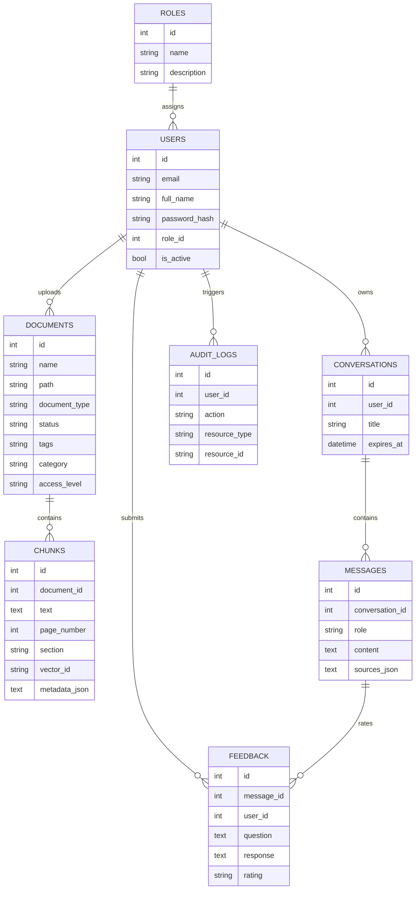

# Database Design

```mermaid
erDiagram
  ROLES ||--o{ USERS : assigns
  USERS ||--o{ DOCUMENTS : uploads
  DOCUMENTS ||--o{ CHUNKS : contains
  USERS ||--o{ CONVERSATIONS : owns
  CONVERSATIONS ||--o{ MESSAGES : contains
  USERS ||--o{ FEEDBACK : submits
  MESSAGES ||--o{ FEEDBACK : rates
  USERS ||--o{ AUDIT_LOGS : triggers

  ROLES {
    int id
    string name
    string description
  }
  USERS {
    int id
    string email
    string full_name
    string password_hash
    int role_id
    bool is_active
  }
  DOCUMENTS {
    int id
    string name
    string path
    string document_type
    string status
    string tags
    string category
    string access_level
  }
  CHUNKS {
    int id
    int document_id
    text text
    int page_number
    string section
    string vector_id
    text metadata_json
  }
  CONVERSATIONS {
    int id
    int user_id
    string title
    datetime expires_at
  }
  MESSAGES {
    int id
    int conversation_id
    string role
    text content
    text sources_json
  }
  FEEDBACK {
    int id
    int message_id
    int user_id
    text question
    text response
    string rating
  }
  AUDIT_LOGS {
    int id
    int user_id
    string action
    string resource_type
    string resource_id
  }
```

