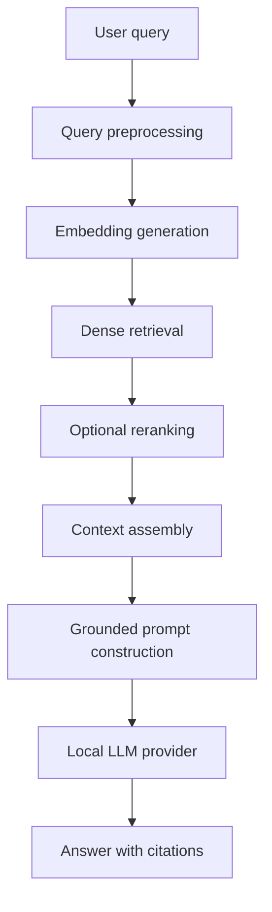

# Developer Guide

## Architecture

KnowledgeHub AI follows Clean Architecture:

- `domain`: business entities and provider/repository ports (e.g. `User`, `Document`, `Chunk`)
- `application`: use cases such as document ingestion (`IngestDocumentUseCase`) and RAG answering (`RAGService.answer`)
- `infrastructure`: SQLAlchemy, local model providers, parsing, vector stores (FAISS), auth (JWT, password hashing), logging
- `presentation`: FastAPI routes, request/response schemas, dependency wiring (e.g., role-based dependency injectors)
- `config`: YAML-backed settings

The application is configuration-driven through `application.yml`. SQLite and FAISS are the default local providers because they require no server process.

### Role-Based Access Control (RBAC) Architecture
- **JWT Authentication**: User identity is verified via access tokens generated with asymmetric/symmetric encryption keys.
- **Route Guards**: presentation layer endpoint access is restricted via dependency injection:
  ```python
  from backend.app.presentation.api.dependencies import require_roles
  
  @router.post("/upload", dependencies=[Depends(require_roles("admin", "knowledge_manager"))])
  ```
  The client layout dynamically reads permissions from the GET `/me` profile endpoint and enforces view/route authorization in the frontend router.

### Document Categorization Architecture
- **Metadata Tagging**: Documents are stored in SQLite with a `category` text field. When a document is ingested, the parser assigns `"category"` to each chunk's metadata JSON.
- **FAISS & SQL Hybrid Filters**: When a user queries with a category filter, the `HybridRetriever` filters the FAISS index using metadata dict evaluations (`filters={"category": category}`) and applies SQL constraints (`where(Document.category == category)`) in SQLAlchemy before blending scores.


## RAG Workflow



## Provider Ports

LLM providers implement:

```python
class LLMProvider:
    async def generate(self, prompt: str) -> str:
        ...
```

Vector stores implement:

```python
class VectorStore:
    def add_documents(self, chunks, embeddings) -> None:
        ...

    def search(self, query_embedding, top_k, filters=None):
        ...
```

## Development Workflow

```bash
python -m venv .venv
source .venv/bin/activate
pip install -r requirements.txt
python setup.py
pytest
python run.py
```

Frontend:

```bash
cd frontend
npm install
npm run dev
```

