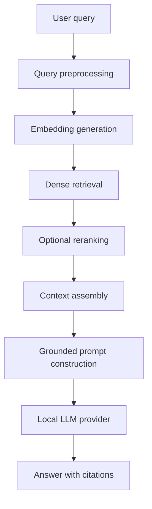

# Developer Guide

## Architecture

KnowledgeHub AI follows Clean Architecture:

- `domain`: business entities and provider/repository ports
- `application`: use cases such as document ingestion and RAG answering
- `infrastructure`: SQLAlchemy, local model providers, parsing, vector stores, auth, logging
- `presentation`: FastAPI routes, request/response schemas, dependency wiring
- `config`: YAML-backed settings

The application is configuration-driven through `application.yml`. SQLite and FAISS are the default local providers because they require no server process.

## RAG Workflow



## Provider Ports

LLM providers implement:

```python
class LLMProvider:
    async def generate(self, prompt: str) -> str:
        ...
```

Vector stores implement:

```python
class VectorStore:
    def add_documents(self, chunks, embeddings) -> None:
        ...

    def search(self, query_embedding, top_k, filters=None):
        ...
```

## Development Workflow

```bash
python -m venv .venv
source .venv/bin/activate
pip install -r requirements.txt
python setup.py
pytest
python run.py
```

Frontend:

```bash
cd frontend
npm install
npm run dev
```

